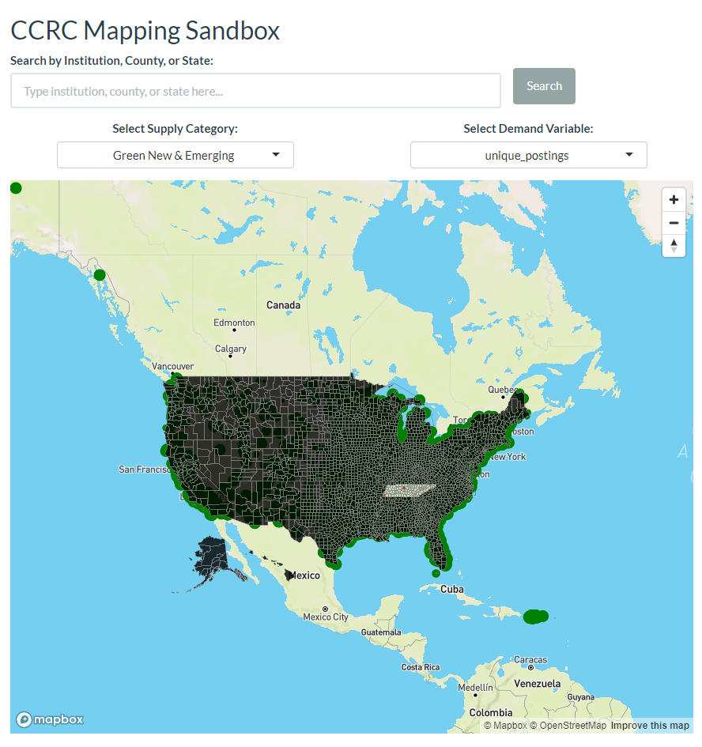
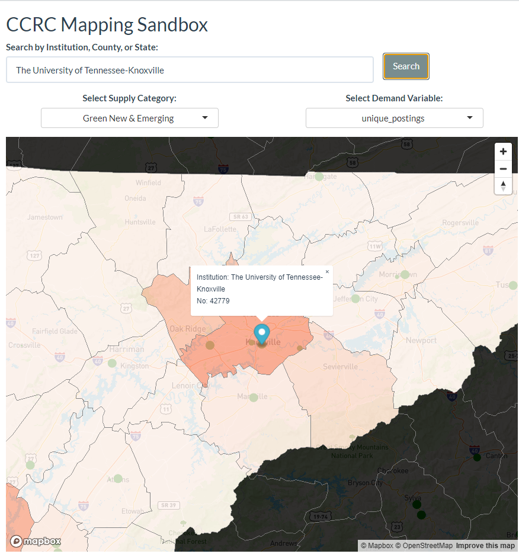

# README.md

## Overview

docs for mapboxr: https://cran.r-project.org/web/packages/mapboxer/vignettes/mapboxer.html

## Data used for the app

data needed to run locally:
  * `ipeds_green_summed.rds`
  * `hdallyears.rds`
  * `counties_sf.rds
  
## Raw data used to create the data used for the app 

`prep-data.R` is used to create the below three files from the raw data and it uses three raw files (in the below data folder):
1. hdallyears.dta
2. ipeds&green.dta
3 TN_test.dta`

data folder, private: https://liveutk-my.sharepoint.com/personal/csublet1_utk_edu/_layouts/15/onedrive.aspx?e=5%3A0b3e911b6a2f48f28fe9b3e7d0c53f70&sharingv2=true&fromShare=true&at=9&CID=882de04e%2D35af%2D4440%2Dad6e%2Db77fea949e96&id=%2Fpersonal%2Fcsublet1%5Futk%5Fedu%2FDocuments%2FResearch%2FGreenJobs&FolderCTID=0x01200008BE93ABE0F3EF43905625E5D5D49057&view=0

## Wei update the app during winterbreak
run locally(Rstudio) the `Institution_Search Marker.R `  instead of app.R (make sure have your mapbox token first)

`Institution_Search Marker.R ` is updating the APP UI and also the sever , the user can input the institution name and see the marker, Zoom the map

### Overall update
1.UI Design update:

2.Institution Search Marker:

### keep update
update the clear btn: `Institution_Search Marker Clear.R `

update the APP `Institution Search.R `: write a  Function(render_map) render the map to reduce the code complexity